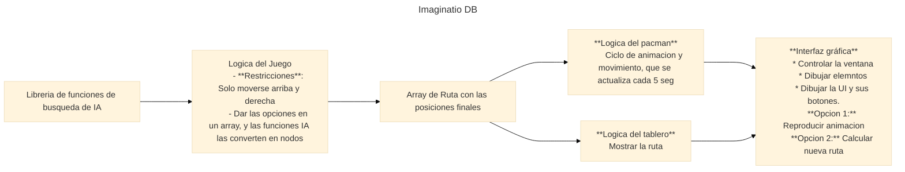

# UMNG IA. Taller de Arboles de búsqueda

Repostorio del taller 1 de la clase de Inteligencia Artificial de la UMNG.

```mermaid
---
title: Imaginatio DB
config: {
  "theme": "base"
}
---
flowchart LR
    A[Libreria de funciones de busqueda de IA]
    B[
        Logica del Juego
        - **Restricciones**: Solo moverse arriba y derecha
        - Dar las opciones en un array, y las funciones IA las converten en nodos
    ]
    C[Array de Ruta con las posiciones finales]
    D1[
        **Logica del pacman**
        Ciclo de animacion y movimiento, que se actualiza cada 5 seg
    ]
    D2[
        **Logica del tablero**
        Mostrar la ruta
    ]
    E[
        **Interfaz gráfica**
        * Controlar la ventana
        * Dibujar elemntos
        * Dibujar la UI y sus botones.
        **Opcion 1:** Reproducir animacion
        **Opcion 2:** Calcular nueva ruta
    ]

    A ---> B
    B ---> C
    C ---> D1
    C ---> D2
    D1 ---> E
    D2 ---> E
```